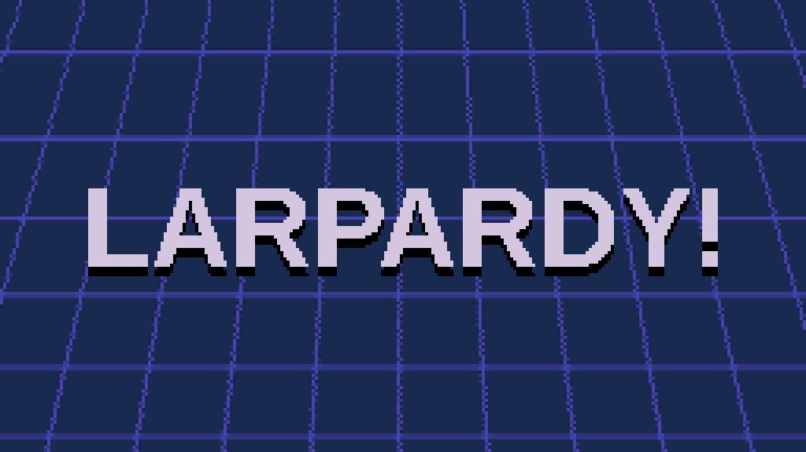
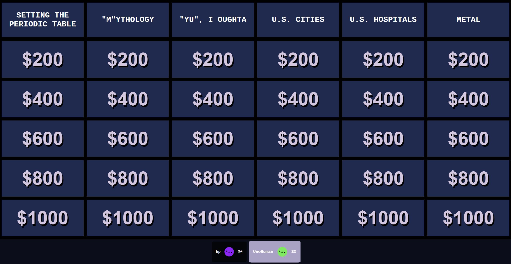
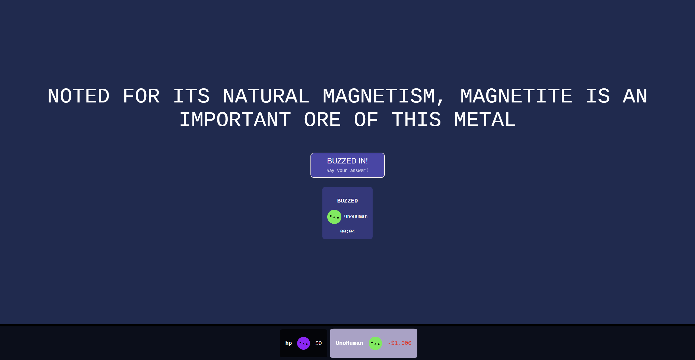

# LARPARDY!

[](https://discord.com/discovery/applications/1521015095738499083)
</img>

Play **LARPARDY!** with your friends in Discord, everyone's favorite game show! Based on a particular popular blue grid trivia game show.

###### This project was originally created as a part of [Stardance](https://stardance.hackclub.com/)!

<p align="center"></img></p>

<p align="left"></img></p>

<p align="right"></img></p>

## How do I play?

In a Discord channel, simply press the Activities button and search for **LARPARDY!**.  
If it doesn't show up, [click here to go directly to the app's page](https://discord.com/discovery/applications/1521015095738499083).

LARPARDY! is most fun with friends! Anybody who joins you in the same channel will join your game.  
You can play as a **host** with your friends and judge their answers, or play in **Hostless Mode** to play alongside them.

If you want to play singleplayer, you can also use **Hostless Mode** to play solo!

> [!NOTE]
> If you need any help, or if something isn't working right, please [join our Discord server](https://discord.gg/bgksu7y4eC) and let us know!

## Features

- Play a trivia game as a host, by yourself, or alongside your friends
- Synced buzzers for everyone
- Judge your friends' answers!
- And, play straight from Discord!

## Running the server

> [!WARNING]
> This is only needed if you are trying to run a local instance for development. If you just want to play the game, please [play the normal version above](#how-do-i-play).

Docker is required.

For local development, run

```
pnpm install
```

You **must** create a `.env` file in order to run the server.
Configure these variables:

```dotenv
VITE_DISCORD_CLIENT_ID=
DISCORD_CLIENT_SECRET=
DISCORD_BOT_TOKEN=

# You should probably change this
REDIS_PASS=SOMETHINGSUPERSECURE123

# If running locally, keep this, or change it to where your server actually is.
REDIS_URL=redis://localhost
```

You also need to add a `clue.db` SQLite database to the `server/` directory, which currently is based on [jepp](https://github.com/ecshreve/jepp)'s database format.

Start the services by running

```
docker compose up -d
```

then

```
pnpm -r dev
```

to run the development servers.

For a production build, use Docker to run the server.

```
docker compose --profile prod up --build -d
```

## Stack

| Component              | Tech                       |
| ---------------------- | -------------------------- |
| Backend                | Node.js + Fastify          |
| Frontend               | TypeScript + Vue.js + Vite |
| Multiplayer networking | Socket.IO                  |
| Database               | Redis (temp. state)        |
| Containerization       | Docker                     |

This project introduced a lot of new tech to me! Vue was entirely new for me and was mostly because I did not want to use React again, and I've come to _really_ like Vue; it made managing components and many other things quite easy.

Socket.IO also made it easier to write higher level netcode (although, still not _easy_...).

Redis maintains state if I decide to scale horizontally, and if the server needs to restart (for example). Persistent data is planned and will likely use PostgreSQL.

## Credits

The logo and user interface use the [Liberation Fonts](https://github.com/liberationfonts/liberation-fonts) and are redistributed under the [SIL Open Font License, Version 1.1](/client/src/assets/fonts/LiberationFontsLICENSE.txt).

The live version of the game uses [jepp](https://github.com/ecshreve/jepp)'s public clue SQL database dump.

Icons used sparsely throughout the game are provided by [Oh, Vue Icons!](https://oh-vue-icons.js.org/) and primarily use the [Bootstrap Icons](https://icons.getbootstrap.com/).

This project wouldn't be possible without [all of the libraries and tech that it's based on](#stack).

And, of course, credit to Jeopardy for their game show, which I have tried to recreate faithfully.

### Sounds

- Decline Buzz/Beep by TannerSound (https://freesound.org/people/TannerSound/sounds/478262/)
- Notify.wav by InfiniteLifespan (https://freesound.org/people/InfiniteLifespan/sounds/266455/)
- correct.mp3 by lionelmatthew001 (https://freesound.org/people/lionelmatthew001/sounds/538333/)
- Glass Bell Ringing by f-r-a-g-i-l-e (https://freesound.org/people/f-r-a-g-i-l-e/sounds/447145/)
